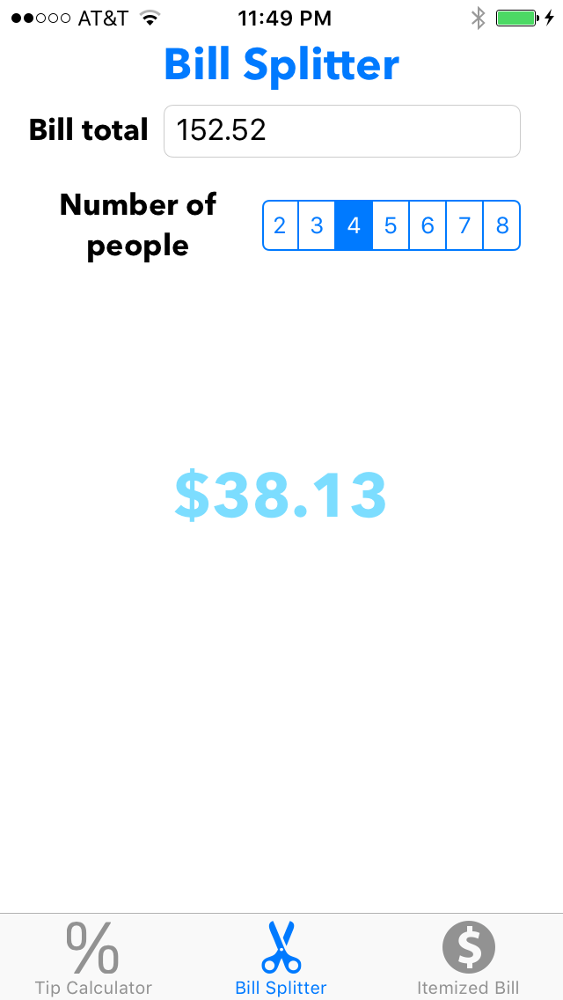

# Restaurant Helper

A master-detail app to help users calculate tax, tip and split bills. Restaurant Helper is an app that helps the user with calculating bills when dining at a restaurant. The app has three view controllers presented with a tab bar controller. 
- The first view controller allows the user to input a bill total, then choose what percentage for tip on a slider. The calculated tip appears with the new bill total beneath it.
- The second view controller allows the user to input the bill total and choose how many people to split the bill between via a segmented control. The bill can be split up to 8 ways.
- The third view controller allows the user to keep track of an itemized bill and input the tax so that the entire bill can be calculated. The bill with tax is presented, and beneath it the bill without tax is presented.

## Requirements

- iOS 8.0+ / Mac OS X 10.9+
- Xcode 7.3+

## License

Restaurant Helper is released under the MIT license. See LICENSE for details.