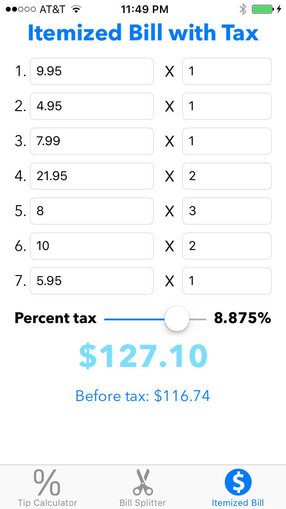

# Restaurant Helper

A master-detail app to help users calculate tax, tip and split bills

## Requirements

- iOS 8.0+ / Mac OS X 10.9+
- Xcode 7.3+

## License

Restaurant Helper is released under the MIT license. See LICENSE for details.